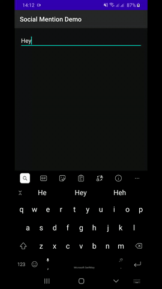

# SocialMentions
Use ("@") to mention people or topics as used in social media apps. The App loads the users to be from a Rest API using Retrofit

## Data 
Search either of the following names
```{
    "status": 200,
    "data": [
        "Wilson",
        "Markus",
        "Allan",
        "Phyian",
        "Irene",
        "Ray",
        "John",
        "Dave",
        "Fred",
        "Mary"
    ],
    "message": "names found successfully"
}
```

## Demo


